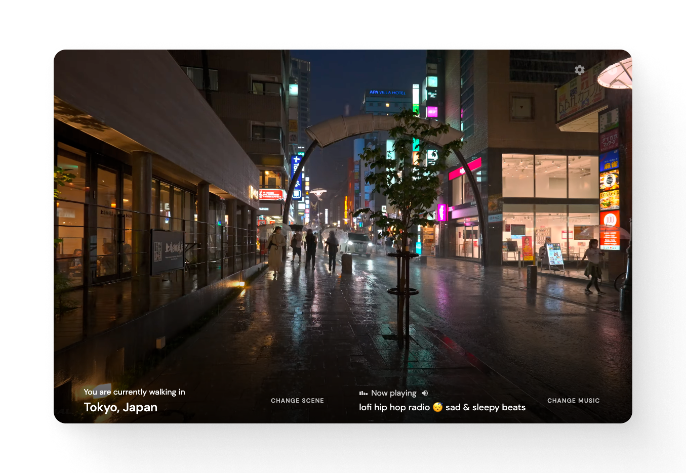

  

   

---

[CityHop Cafe](https://cityhop.cafe) is a magical corner of the internet where you can take relaxing strolls and drives through different corners of the world, all from the comfort from your desk!

Tune into lofi, synthwave, and even pop music as you explore some of the world's greatest cities.

Just sit back and relax 🎶

  

---

**Around The Web**

- [City Hop allows you to listen to chill tunes as you virtually walk around various cities](https://boingboing.net/2023/06/03/city-hop-allows-you-to-listen-to-chill-tunes-as-you-virtually-walk-around-various-cities.html)
- [유튜브 4K 산책 영상과 유튜브 음악을 혼합한 CityHop](https://blog.naver.com/PostView.naver?blogId=ifp1592&logNo=223127482066&searchKeyword=cityhop)
- [「CityHop」チルい音楽を聴きながら世界中の街角を散歩できるサイト](https://netafull.net/web/0131449.html)
- [YouTubeの散歩＆ドライブ映像にラジオや音楽を重ねてひたすら作業用映像として垂れ流しにできる「CityHop」](https://gigazine.net/news/20230611-cityhop/)
- [チルミュージックを聴きながら様々な都市をバーチャルに旅するサイト「CityHop Cafe」が話題に](https://amass.jp/167209/)
